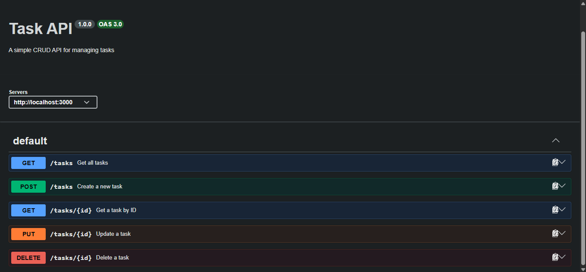

# 🚀 Task API

A simple RESTful CRUD API for managing a to-do list, built with **Node.js** and **Express.js** as part of the **FlyRank AI Internship — Backend AI Engineering track**.

The API provides complete task management functionality, input validation, proper HTTP status codes, and interactive API documentation using Swagger UI.

---

## ✨ Features

- Create tasks
- Get all tasks
- Get a task by ID
- Update tasks
- Delete tasks
- Input validation
- Proper HTTP status codes
- 404 handling for non-existent tasks
- Interactive Swagger UI documentation
- In-memory data storage
- RESTful API design

---

## 🛠️ Tech Stack

- **Node.js**
- **Express.js**
- **JavaScript**
- **Swagger UI Express**
- **In-memory data storage**

---

## 📋 Prerequisites

Make sure you have the following installed:

- Node.js
- npm
- Git

You can verify your installation with:

```bash
node --version
npm --version
git --version
```

---

## 📦 Installation

Clone the repository:

```bash
git clone <YOUR_GITHUB_REPOSITORY_URL>
cd flyrank-be-01-crud-api
```

Install the dependencies:

```bash
npm install
```

---

## ▶️ Run the API

Start the server with:

```bash
node server.js
```

The API will be available at:

```text
http://localhost:3000
```

You should see:

```text
Server running at http://localhost:3000
```

---

## 📚 API Documentation

Interactive Swagger UI documentation is available at:

```text
http://localhost:3000/docs
```

Swagger UI allows you to test all CRUD operations directly from the browser using the **Try it out** functionality.

---

## 🔗 API Endpoints

| Method | Endpoint | Description |
|--------|----------|-------------|
| GET | `/` | Get API information |
| GET | `/health` | Check API health |
| GET | `/tasks` | Get all tasks |
| GET | `/tasks/:id` | Get a task by ID |
| POST | `/tasks` | Create a new task |
| PUT | `/tasks/:id` | Update a task |
| DELETE | `/tasks/:id` | Delete a task |

---

## 🧪 Example Requests

> On Windows PowerShell, use `curl.exe` instead of `curl`.

### Get API Information

```bash
curl.exe -i http://localhost:3000/
```

Example response:

```json
{
  "name": "Task API",
  "version": "1.0",
  "endpoints": ["/tasks"]
}
```

---

### Health Check

```bash
curl.exe -i http://localhost:3000/health
```

Example response:

```json
{
  "status": "ok"
}
```

---

### Get All Tasks

```bash
curl.exe -i http://localhost:3000/tasks
```

Example response:

```json
[
  {
    "id": 1,
    "title": "Learn Node.js",
    "done": false
  },
  {
    "id": 2,
    "title": "Build a REST API",
    "done": false
  },
  {
    "id": 3,
    "title": "Practice Git",
    "done": true
  }
]
```

---

### Get a Task by ID

```bash
curl.exe -i http://localhost:3000/tasks/1
```

Example response:

```json
{
  "id": 1,
  "title": "Learn Node.js",
  "done": false
}
```

---

### Create a Task

```bash
curl.exe -i -X POST http://localhost:3000/tasks `
  -H "Content-Type: application/json" `
  -d '{"title":"Buy milk"}'
```

Example response:

```json
{
  "id": 4,
  "title": "Buy milk",
  "done": false
}
```

HTTP status:

```text
201 Created
```

---

### Update a Task

```bash
curl.exe -i -X PUT http://localhost:3000/tasks/1 `
  -H "Content-Type: application/json" `
  -d '{"title":"Learn Express","done":true}'
```

Example response:

```json
{
  "id": 1,
  "title": "Learn Express",
  "done": true
}
```

HTTP status:

```text
200 OK
```

---

### Delete a Task

```bash
curl.exe -i -X DELETE http://localhost:3000/tasks/1
```

Successful deletion returns:

```text
HTTP/1.1 204 No Content
```

The response body is empty.

---

## ✅ Validation

The API validates task data when creating and updating tasks.

### Create Task Validation

The `title` field is required when creating a task.

Invalid request:

```json
{
  "title": ""
}
```

Response:

```json
{
  "error": "Title is required"
}
```

Status code:

```text
400 Bad Request
```

---

### Update Task Validation

When updating a task:

- `title` must be a non-empty string if provided.
- `done` must be a boolean if provided.

Invalid task data returns:

```json
{
  "error": "Invalid task data"
}
```

Status code:

```text
400 Bad Request
```

---

## ❌ Error Handling

The API returns `404 Not Found` when a requested task does not exist.

Example:

```bash
curl.exe -i http://localhost:3000/tasks/999
```

Response:

```json
{
  "error": "Task 999 not found"
}
```

Status code:

```text
404 Not Found
```

---

## 📊 HTTP Status Codes

| Status Code | Meaning |
|-------------|---------|
| `200` | Request successful |
| `201` | Resource created successfully |
| `204` | Resource deleted successfully |
| `400` | Invalid request data |
| `404` | Task not found |

---

## 🖥️ Swagger UI

The project includes interactive Swagger UI documentation for the complete CRUD API.

Open:

```text
http://localhost:3000/docs
```

The Swagger documentation covers:

- `GET /tasks`
- `POST /tasks`
- `GET /tasks/{id}`
- `PUT /tasks/{id}`
- `DELETE /tasks/{id}`

### Swagger Screenshot



---

## 🧾 API Test Output

The following tests were executed locally using `curl.exe`.

### GET `/`

```text
PS C:\Users\PC\Desktop\flyrank-be-01-crud-api> curl.exe -i http://localhost:3000/
HTTP/1.1 200 OK
X-Powered-By: Express
Content-Type: application/json; charset=utf-8
Content-Length: 58
ETag: W/"3a-MI5kmM1z/AHKxM8xo8cNqUThTqA"
Date: Wed, 02 Sep 2026 21:32:40 GMT
Connection: keep-alive
Keep-Alive: timeout=5

{"name":"Task API","version":"1.0","endpoints":["/tasks"]}
```

### GET `/health`

```text
PS C:\Users\PC\Desktop\flyrank-be-01-crud-api> curl.exe -i http://localhost:3000/health
HTTP/1.1 200 OK
X-Powered-By: Express
Content-Type: application/json; charset=utf-8
Content-Length: 15
ETag: W/"f-VaSQ4oDUiZblZNAEkkN+sX+q3Sg"
Date: Wed, 02 Sep 2026 21:32:48 GMT
Connection: keep-alive
Keep-Alive: timeout=5

{"status":"ok"}
```

### GET `/tasks`

```text
PS C:\Users\PC\Desktop\flyrank-be-01-crud-api> curl.exe -i http://localhost:3000/tasks
HTTP/1.1 200 OK
X-Powered-By: Express
Content-Type: application/json; charset=utf-8
Content-Length: 140
ETag: W/"8c-Jy7qBrmoqcNXUHmc/szqgoSozgw"
Date: Wed, 02 Sep 2026 21:32:58 GMT
Connection: keep-alive
Keep-Alive: timeout=5

[{"id":1,"title":"Learn Node.js","done":false},{"id":2,"title":"Build a REST API","done":false},{"id":3,"title":"Practice Git","done":true}]
```

---

## 📁 Project Structure

```text
flyrank-be-01-crud-api/
│
├── docs/
│   └── swagger-ui.png
│
├── .gitignore
├── package.json
├── package-lock.json
├── server.js
└── README.md
```

> `node_modules/` is intentionally excluded from the repository through `.gitignore`.

---

## 💾 Data Storage

This project uses an **in-memory array** to store tasks.

This means that:

- No external database is required.
- Task data is stored only while the server is running.
- All tasks are reset whenever the server restarts.

This approach keeps the project simple and focused on REST API fundamentals.

---

## 🧪 Testing

The API was tested using:

- Swagger UI
- `curl.exe`
- Browser requests for GET endpoints
- PowerShell HTTP requests

The following scenarios were tested:

- Creating a task
- Reading all tasks
- Reading a task by ID
- Updating a task
- Deleting a task
- Invalid task data
- Requesting a non-existent task
- Swagger CRUD operations
- Health check endpoint

---

## 📌 Project Requirements

This project implements the main requirements of the FlyRank **BE-01 — Build Your First CRUD API** assignment:

- RESTful CRUD API
- Node.js and Express.js
- In-memory task storage
- Input validation
- HTTP status codes
- 404 error handling
- Swagger UI documentation
- Public GitHub repository
- README documentation
- API testing evidence

---

## 📈 Project Status

**Stage 6 — Publish and Documentation**

Completed:

- ✅ REST API implemented
- ✅ CRUD operations implemented
- ✅ Input validation implemented
- ✅ HTTP status codes implemented
- ✅ 404 handling implemented
- ✅ Swagger UI configured
- ✅ CRUD endpoints documented
- ✅ Swagger CRUD operations tested
- ✅ Swagger screenshot added
- ✅ README documentation completed
- ✅ API test output documented
- ✅ GitHub publication

---

## 🎓 Internship

Developed as part of the:

**FlyRank AI Internship — Backend AI Engineering Track**

Assignment:

**BE-01 — Build Your First CRUD API**

---

## 📝 Notes

This project intentionally uses in-memory storage for the assignment.

Database persistence is not required. The primary goal is to demonstrate:

- Backend API fundamentals
- RESTful design
- CRUD operations
- Input validation
- HTTP status codes
- API documentation
- API testing
- Git and GitHub workflow
